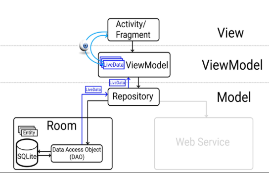
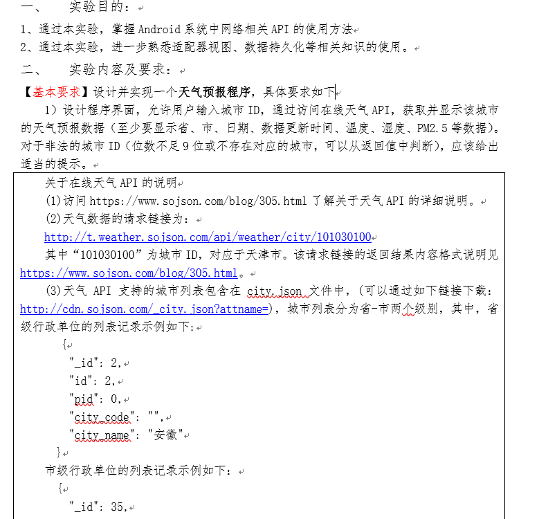
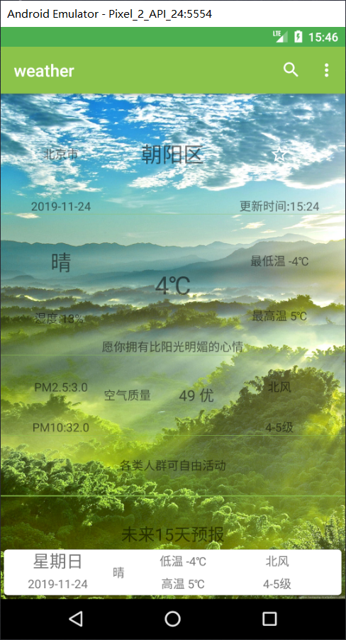
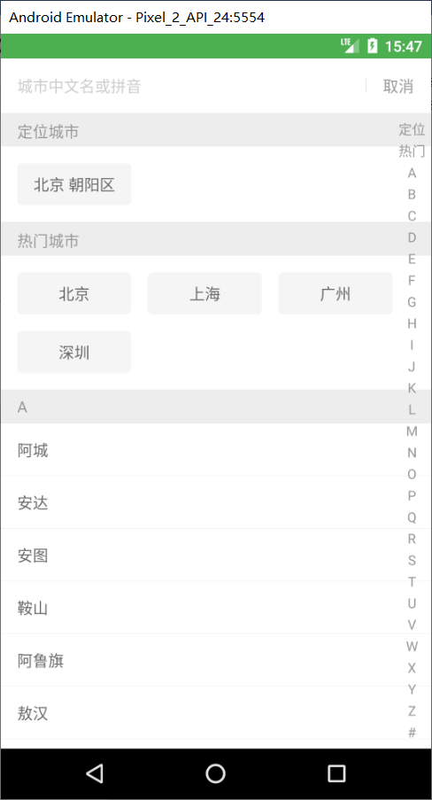
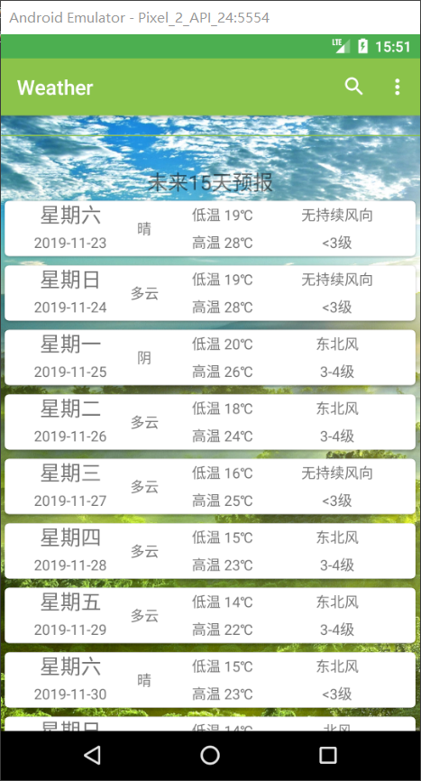
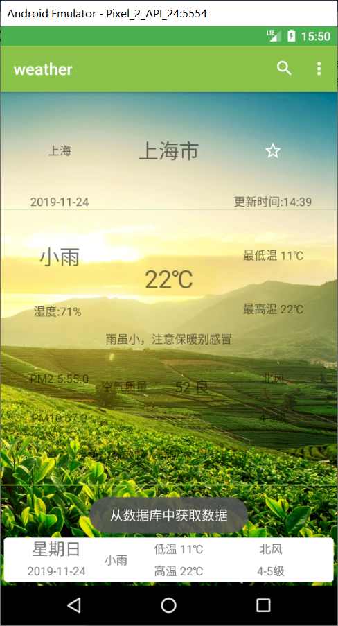
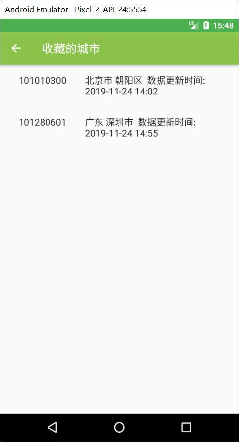

Weather
=========================


Introduction
------------


Screenshots
-----------







Libraries Used
--------------
```
    implementation "androidx.swiperefreshlayout:swiperefreshlayout:1.0.0"
    implementation 'androidx.navigation:navigation-fragment:2.1.0'
    implementation 'androidx.navigation:navigation-ui:2.1.0'

    def room_version = '2.2.1'
    implementation "androidx.room:room-runtime:$room_version"
    annotationProcessor "androidx.room:room-compiler:$room_version"

    def lifecycle_version = "2.1.0"
    implementation "androidx.lifecycle:lifecycle-extensions:$lifecycle_version"
    implementation 'com.android.support.constraint:constraint-layout:1.1.3'

    implementation "com.squareup.okhttp3:okhttp:4.2.2"
    implementation "com.google.code.gson:gson:2.8.4"
    implementation 'com.zaaach:citypicker:2.0.3'
```